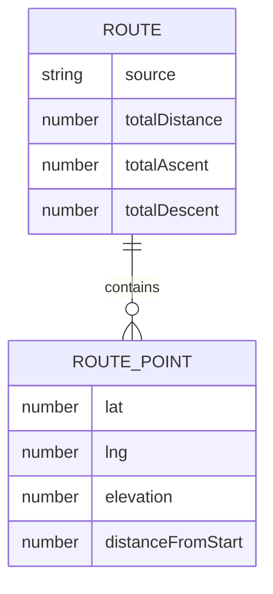

# 機能設計書

## 1. システム構成図

本サービスはサーバーサイドを持たない、完全にブラウザ内で完結する静的Webアプリケーションである。
GitHub Pages上でホスティングし、外部通信は国土地理院APIへのリクエストのみ行う。

```mermaid
graph TD
    User[ユーザー(ブラウザ)] -->|アクセス| Static[GitHub Pages<br/>静的サイト]
    Static -->|HTML/CSS/JS配信| User
    User -->|地図クリック| MapModule[地図表示・入力モジュール<br/>Leaflet]
    MapModule -->|地図タイル取得| GSITile[国土地理院<br/>地図タイルAPI]
    User -->|GPXアップロード(次期)| GPXModule[GPXパースモジュール]
    MapModule -->|ルート座標列| ElevationModule[標高取得モジュール]
    GPXModule -->|ルート座標列| ElevationModule
    ElevationModule -->|緯度経度から標高取得| GSIElevation[国土地理院<br/>標高API(DEM)]
    ElevationModule -->|距離・標高データ| ChartModule[断面図描画モジュール<br/>Chart.js]
    ChartModule -->|グラフ描画| User
```

## 2. データモデル定義

サーバー・DBを持たないため、すべてブラウザメモリ上(JavaScriptオブジェクト)で完結する。

### RoutePoint(ルート上の1地点)

| フィールド | 型 | 説明 |
|---|---|---|
| lat | number | 緯度 |
| lng | number | 経度 |
| elevation | number \| null | 標高(m)。取得前はnull |
| distanceFromStart | number | 起点からの累積距離(m) |

### Route(ルート全体)

| フィールド | 型 | 説明 |
|---|---|---|
| points | RoutePoint[] | ルートを構成する地点の配列(入力順) |
| totalDistance | number | 総距離(m) |
| totalAscent | number | 総獲得標高・上り(m) |
| totalDescent | number | 総獲得標高・くだり(m) |
| source | "map" \| "gpx" | ルートの入力元 |

### ER図(概念)

DB永続化はしないが、モジュール間で受け渡すデータ構造として整理する。



## 3. コンポーネント設計

| コンポーネント | 役割 |
|---|---|
| MapView | 国土地理院タイルを表示し、クリックでRoutePointを追加。直前地点削除・リセット操作を提供 |
| GpxUploader(次期) | GPXファイルの選択・ドラッグ&ドロップ受付、パースしてRoutePoint配列を生成 |
| ElevationService | 緯度経度配列を受け取り、国土地理院の標高APIから標高値を取得してRoutePointに反映 |
| DistanceCalculator | Haversine公式で各区間の距離を算出し、累積距離・総距離・総獲得標高を計算 |
| ElevationChart | 累積距離を横軸、標高を縦軸としたラインチャートを描画。上り/くだり区間を色分け |
| SummaryPanel | 総距離・総獲得標高(上り/くだり)を表示 |
| AppController | 上記コンポーネントを統括し、ルート入力→標高取得→計算→描画の一連の流れを制御 |

## 4. ユースケース図

```mermaid
graph LR
    Cyclist((サイクリスト))
    Cyclist --> UC1[地図をクリックしてルートを作成する]
    Cyclist --> UC2[直前の地点を削除する]
    Cyclist --> UC3[ルートをリセットする]
    Cyclist --> UC4[断面図を確認する]
    Cyclist --> UC5[総距離・獲得標高を確認する]
    Cyclist --> UC6[GPXファイルを読み込む(次期)]
```

## 5. 画面遷移図・ワイヤーフレーム

本サービスは単一画面(SPA的な1ページ構成)で完結する。

```mermaid
graph TD
    Start([サイトにアクセス]) --> Main[メイン画面]
    Main -->|地図クリック| Main
    Main -->|GPXアップロード(次期)| Main
    Main -->|地点追加のたびに自動更新| Chart[断面図・サマリー表示]
```

### 画面イメージ(ワイヤーフレーム概略)

```
┌───────────────────────────────────────────┐
│  タイトル: ルート標高断面図ツール            │
├───────────────────────────────────────────┤
│                                             │
│                地図エリア                    │
│           (クリックでルート作成)              │
│                                             │
├───────────────────────────────────────────┤
│                                             │
│           標高断面図(折れ線グラフ)            │
│      横軸: 累積距離 / 縦軸: 標高               │
│                                             │
├───────────────────────────────────────────┤
│  総距離: XX.X km   総上り: XXX m   総くだり: XXX m │
│  [リセット] [1つ戻す] [GPXアップロード(次期)]    │
└───────────────────────────────────────────┘
```

## 6. API設計

自前のバックエンドAPIは持たない。外部APIとして以下を利用する。

### 国土地理院 地図タイルAPI

- 用途: MapViewでの地図表示
- 形式: `https://cyberjapandata.gsi.go.jp/xyz/{タイル種別}/{z}/{x}/{y}.png`
- 認証: 不要(出典表示のみ必須)

### 国土地理院 標高API

- 用途: ElevationServiceでの標高取得
- 形式: 緯度経度を指定して標高(DEM)を取得するAPIエンドポイントを利用
- 認証: 不要(出典表示のみ必須)
- 注意点: 大量地点を一括取得する仕組みがないため、クリック地点数に応じた
  逐次/バッチリクエストの設計が必要(architecture.mdで詳細検討)
