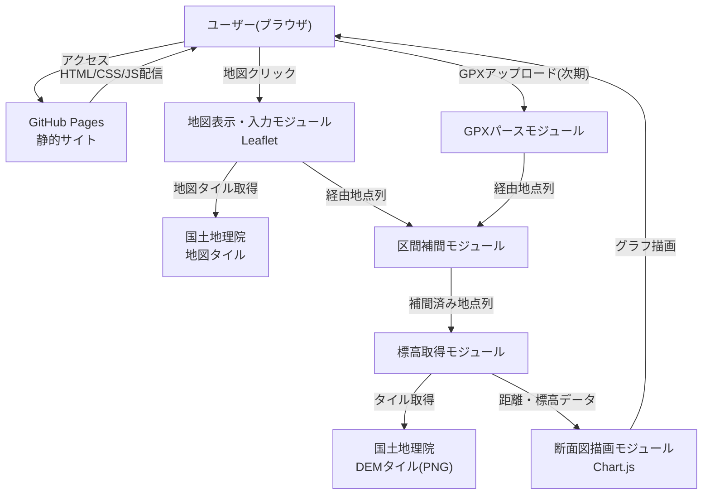
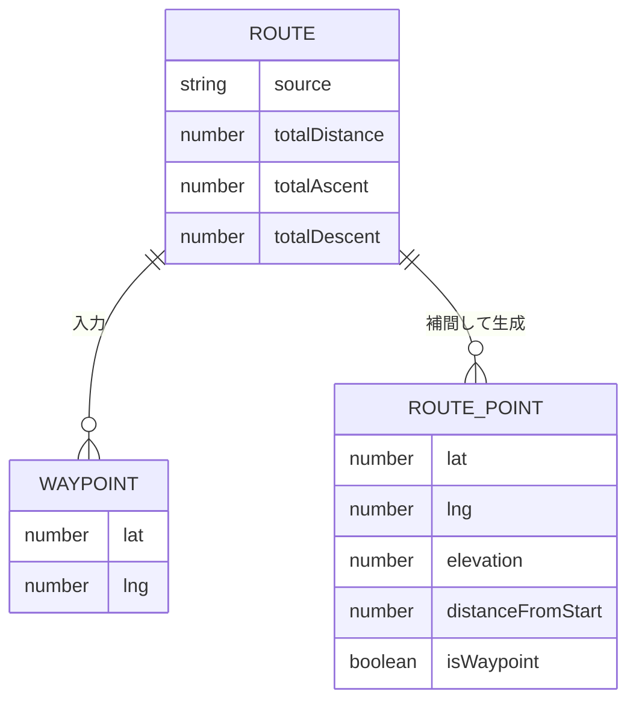
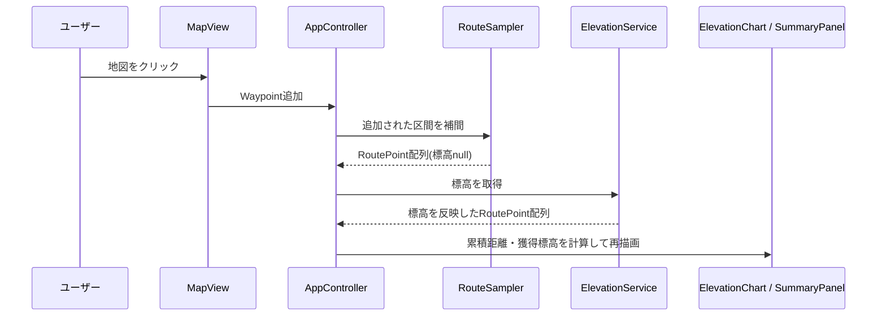
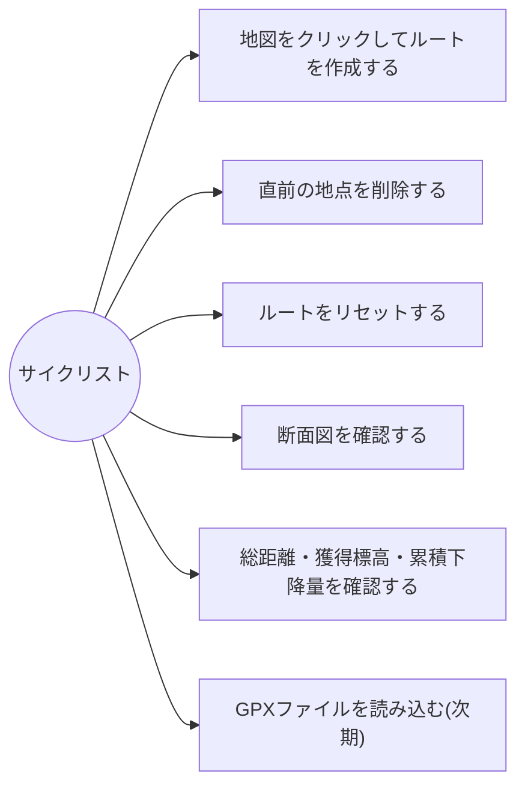

# 機能設計書

## 1. システム構成図

本サービスはサーバーサイドを持たない、完全にブラウザ内で完結する静的Webアプリケーションである。
GitHub Pages上でホスティングし、外部通信は国土地理院のタイル(地図タイル・DEMタイル)の取得のみ行う。



## 2. データモデル定義

サーバー・DBを持たないため、すべてブラウザメモリ上(JavaScriptオブジェクト)で完結する。

ユーザーがクリックした地点(経由地点)と、断面図を描くために経由地点間を補間した地点(RoutePoint)を区別して扱う。

### Waypoint(経由地点)

| フィールド | 型 | 説明 |
|---|---|---|
| lat | number | 緯度 |
| lng | number | 経度 |

### RoutePoint(断面図を構成する1地点)

| フィールド | 型 | 説明 |
|---|---|---|
| lat | number | 緯度 |
| lng | number | 経度 |
| elevation | number \| null | 標高(m)。取得前、またはDEMにデータがない地点(海上・国外等)はnull |
| distanceFromStart | number | 起点からの累積距離(m) |
| isWaypoint | boolean | 経由地点そのものであればtrue、補間点であればfalse |

### Route(ルート全体)

| フィールド | 型 | 説明 |
|---|---|---|
| waypoints | Waypoint[] | ユーザーが入力した経由地点の配列(入力順) |
| points | RoutePoint[] | 経由地点と補間点を合わせた、断面図用の地点配列 |
| totalDistance | number | 総距離(m) |
| totalAscent | number | 獲得標高(m)。上りの合計 |
| totalDescent | number | 累積下降量(m)。下りの合計 |
| source | "map" \| "gpx" | ルートの入力元 |

### ER図(概念)

DB永続化はしないが、モジュール間で受け渡すデータ構造として整理する。



## 3. コンポーネント設計

| コンポーネント | 役割 |
|---|---|
| MapView | 国土地理院タイルを表示し、クリックでWaypointを追加。直前地点削除・リセット操作を提供 |
| GpxUploader(次期) | GPXファイルの選択・ドラッグ&ドロップ受付、パースしてWaypoint配列を生成 |
| RouteSampler | 経由地点間を直線で結び、サンプリング間隔(初期値50m)ごとに補間点を生成してRoutePoint配列を作る |
| ElevationService | RoutePoint配列を受け取り、国土地理院DEMタイルを取得・デコードして標高を反映する(タイルはキャッシュする) |
| DistanceCalculator | Haversine公式で各区間の距離を算出し、累積距離・総距離を計算。標高を平滑化し、獲得標高・累積下降量を計算 |
| ElevationChart | 累積距離を横軸、標高を縦軸としたラインチャートを描画。上り/下り区間を色分け。標高の取得中はその旨を表示 |
| SummaryPanel | 総距離・獲得標高・累積下降量を表示 |
| AppController | 上記コンポーネントを統括し、ルート入力→補間→標高取得→計算→描画の一連の流れを制御 |

### 処理の流れ(経由地点を1つ追加したとき)



追加された区間のみ補間・標高取得を行い、既存区間の結果は再利用する。

### 獲得標高の計算と上り/下りの色分け

DEMの値には細かいノイズがあり、そのまま標高差を合計すると平坦な道でも獲得標高が過大になる。
そのため、以下の手順で計算する。

1. **平滑化**: 各地点の標高を、前後100m(窓幅200m)の移動平均で置き換える。
   標高がnullの地点は平均の計算から除く
2. **閾値による判定**: 直前に確定した基準標高から、平滑化後の標高が閾値(3m)以上
   上がったら上り、下がったら下りとして差分を加算し、基準標高を更新する。閾値未満の変化は加算しない
3. **色分け**: 平滑化後の標高で、隣り合う地点間の勾配が正なら上りの色、0以下なら下りの色で描画する

| パラメータ | 初期値 |
|---|---|
| 移動平均の窓幅 | 200m(前後100m) |
| 上り/下り判定の閾値 | 3m |

断面図の線は平滑化後の標高で描画する。パラメータは定数として定義し、実装後の確認結果に応じて調整する。

### 非同期処理と操作の競合

標高の取得は非同期で行うため、取得中にユーザーが「1つ戻す」「リセット」を行うと、
削除した区間の結果が後から反映されるおそれがある。これを防ぐため、以下のように制御する。

- 標高取得の結果は、取得を依頼した`RoutePoint`オブジェクトの`elevation`フィールドを
  直接書き換えることで反映する(配列を作り直さず、オブジェクトへの参照を保持したまま更新する)
- 「1つ戻す」「リセット」は`route.points`配列から該当オブジェクトへの参照を外すことで区間を削除する。
  参照が外れた後に取得結果が返ってきてオブジェクトを書き換えても、`route.points`から
  辿れないため画面には反映されない(取得したタイルはキャッシュに残るため、再取得の無駄は生じない)
- 単に新しい経由地点が追加されただけの場合は、既存のオブジェクトは`route.points`に残り続けるため、
  取得中に追加の操作が行われても、以前の区間の取得結果は正しく反映される
  (世代番号で一律に破棄する方式は、連続してクリックした際に直前の区間の結果まで
  破棄してしまう不具合があるため採用しない)
- 標高の取得が1件でも完了するたびに、その時点の`route.points`をもとに断面図・サマリーを再計算する
- 取得中も地図のクリック・ボタン操作は無効化しない
- 取得中は、断面図エリアに取得中であることを表示する(進行中の取得が0件になったら非表示にする)

## 4. ユースケース図



## 5. 画面構成・ワイヤーフレーム

本サービスは単一画面(SPA的な1ページ構成)で完結する。
地点の追加・削除やGPX読み込みのたびに、同じ画面内の断面図・サマリーが自動更新される。

### 画面イメージ(ワイヤーフレーム概略)

```
┌───────────────────────────────────────────┐
│  タイトル: ルート標高断面図ツール            │
├───────────────────────────────────────────┤
│                                             │
│                地図エリア                    │
│           (クリックでルート作成)              │
│                                             │
├───────────────────────────────────────────┤
│                                             │
│           標高断面図(折れ線グラフ)            │
│      横軸: 累積距離 / 縦軸: 標高               │
│                                             │
├───────────────────────────────────────────┤
│  総距離: XX.X km   総上り: XXX m   総下り: XXX m  │
│  [リセット] [1つ戻す] [GPXアップロード(次期)]    │
├───────────────────────────────────────────┤
│  出典: 国土地理院(地図タイル・標高タイル)      │
└───────────────────────────────────────────┘
```

## 6. API設計

自前のバックエンドAPIは持たない。外部リソースとして以下を利用する。

### 国土地理院 地図タイル

- 用途: MapViewでの地図表示
- 形式: `https://cyberjapandata.gsi.go.jp/xyz/{タイル種別}/{z}/{x}/{y}.png`
- 認証: 不要(出典表示のみ必須)

### 国土地理院 DEMタイル(標高タイル)

- 用途: ElevationServiceでの標高取得
- 形式: PNG(256×256ピクセル)。CORS対応(`Access-Control-Allow-Origin: *`)
- 認証: 不要(出典表示のみ必須)

| 優先順 | タイル種別 | URL | ズーム | 格子間隔 | 備考 |
|---|---|---|---|---|---|
| 1 | DEM5A | `https://cyberjapandata.gsi.go.jp/xyz/dem5a_png/{z}/{x}/{y}.png` | 15 | 約5m | 航空レーザー測量。整備範囲が限定的 |
| 2 | DEM5B | `https://cyberjapandata.gsi.go.jp/xyz/dem5b_png/{z}/{x}/{y}.png` | 15 | 約5m | 写真測量 |
| 3 | DEM10B | `https://cyberjapandata.gsi.go.jp/xyz/dem_png/{z}/{x}/{y}.png` | 14 | 約10m | 全国整備 |

- **フォールバック**: 上位のタイルが存在しない(HTTP 404)、または該当ピクセルが無効値の場合、次の優先順のタイルを参照する
- **標高の算出**: ピクセルのRGB値から `x = R×2^16 + G×2^8 + B` を求め、
  - `x < 2^23` のとき 標高 = `x × 0.01` (m)
  - `x = 2^23` のとき 無効値(データなし)
  - `x > 2^23` のとき 標高 = `(x − 2^24) × 0.01` (m)
- **補間**: 対象地点の周囲4ピクセルから双線形補間で標高を求める
- **デコード方法**: `crossOrigin = "anonymous"` で画像を読み込み、canvasに描画して `getImageData` でRGB値を取得する
- **キャッシュ**: 取得・デコード済みのタイルはメモリ上にキャッシュし、同じタイルを再取得しない
- **全タイルで無効値の地点**(海上・国外等): `elevation` をnullとし、断面図ではその区間を途切れさせて表示し、ユーザーに対象外エリアである旨を通知する
